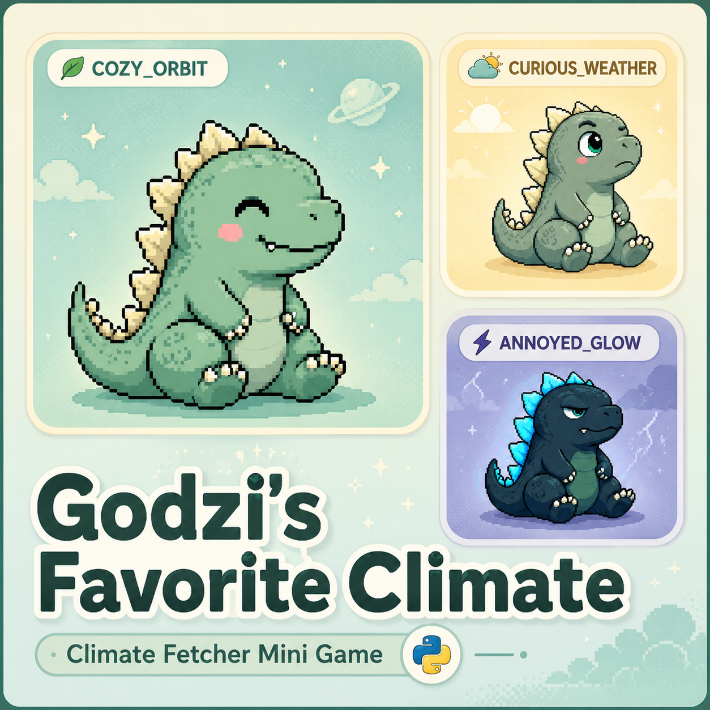

# Godzi's Favorite Climate 🌤️🦖

*A tiny golden-ratio weather orbit — Code In Place, Stanford*



## The Idea

It started with a simple question: **how do you turn data — any data — into something that feels fun, alive, and meaningful enough that people actually want to look at it?**

Most weather apps show you numbers: 22°C, 60% clouds, 14 km/h wind. Numbers are accurate, but they don't *mean* anything emotionally. So this project asks: what if the data had a mood? What if "22°C and a bit cloudy" wasn't just three numbers, but a tiny creature deciding whether today is a good day to be outside?

That creature is **Godzi** — a baby Godzilla whose mood reacts to real, live weather from anywhere in the world.

The deeper goal behind this project isn't really about Godzilla, or even about weather. It's about **finding the simplest possible bridge between data and feeling** — a translation that someone who has never seen a formula in their life can still understand just by *looking* at Godzi's face. If a 6-year-old can tell whether Godzi is happy just by glancing at the screen, the translation worked.

## The Math Behind the Mood (and Why It's the Golden Ratio)

The original ambition was bigger: build an equation complex enough to animate Godzi's *tail* in response to the weather — little movements that mirror the chaos of real atmospheric systems. That's a genuinely hard problem (the kind that needs differential equations and simulation, not a weekend project).

What we *could* do — and what became the real core of this project — was use the **Golden Ratio (φ ≈ 1.618)** as a simple, elegant, and teachable way to turn several weather variables into a single "comfort score":

1. Take the current weather (temperature, cloud cover, wind, rain).
2. Measure how far each value is from Godzi's "ideal day" (`comfort_model.py` → `golden_distance`).
3. Shrink that distance into a comfort score between 0 and 1 using `e^(-φ × distance)` — the same exponential-decay shape that shows up in golden-ratio spirals, Fibonacci growth, and nature in general.
4. Map that single number to one of three moods.

It's not the advanced "tail physics" equation we dreamed of — but it's a real, working example of **using a mathematical constant to make data feel intuitive**, which is exactly the kind of translation this project set out to find.

## One Idea, Three Expressions

The golden-ratio thread doesn't stop at the comfort score — it shows up again in how Godzi *sounds*:

- `comfort_model.py` uses **φ** to turn weather "distance" into a comfort score.
- `sound_system.py` uses the **Fibonacci sequence** (1, 1, 2, 3, 5, 8, 13, 21 — the sequence that converges to φ) to decide how long each mood's "growl" lasts, and a pentatonic scale to pick which note plays.
- `sprite_renderer.py` then shows the matching Godzi face.

Same idea, three different senses — a score, a sound, and a face — all moving together.

## Godzi's Moods

| Mood | Comfort score | Roughly happens when... |
|---|---|---|
| 🟢 **COZY_ORBIT** | ≥ 0.15 | 18–21°C, mild clouds, gentle wind — Godzi's ideal day |
| 🟡 **CURIOUS_WEATHER** | ≥ 0.0035 | 22–24°C — it's starting to get uncomfortable |
| 🔴 **ANNOYED_GLOW** | < 0.0035 | 25°C+ (or far from ideal in other ways) — Godzi is not having it |

These thresholds aren't arbitrary — they were calibrated against six months of real weather data from Mexico City, Stanford, and Tokyo (see [Calibration Tools](#calibration-tools) below).

Weather is read **live** (current conditions, not averages) from [Open-Meteo](https://open-meteo.com/) — so Godzi reacts to *right now*, not "usually."

## Getting Started

**Requirements:** Python 3.10+ and an internet connection (the app fetches live weather from Open-Meteo on startup and on every city click).

```bash
# (optional) create a virtual environment
python -m venv venv
venv\Scripts\activate      # Windows
source venv/bin/activate   # macOS/Linux

# install dependencies
pip install -r requirements.txt

# run the app
python main.py
```

This opens a small Pygame window. Click any city button to fetch its current weather and watch Godzi react — both visually (the sprite changes) and audibly (a short procedural "growl" plays whenever the mood changes).

> **Windows tip:** don't double-click `main.py` to run it — if a dependency is missing, the console window flashes and closes before you can read the error. Always run it from a terminal as shown above so you can see what's happening.

Prefer a plain-text version? `python weather.py` prints a comfort report for every city, no window needed.

## Project Structure

| File | What it does |
|---|---|
| `main.py` | The Pygame app: city buttons, weather panel, Godzi sprite, sound |
| `comfort_model.py` | The golden-ratio comfort formula and mood thresholds |
| `data_fetcher.py` | Talks to the Open-Meteo API (live current weather + historical data) |
| `weather.py` | Command-line comfort report, no graphics needed |
| `sprite_renderer.py` | Loads and draws the right Godzi PNG for the current mood |
| `sound_system.py` | Procedural Fibonacci/pentatonic "growl" generator |
| `Imágenes/` | The three Godzi mood sprites, plus `Portada.png` (the cover image above) |
| `Sounds/` | Downloaded kaiju growl samples — kept for a possible future easter egg, not used by `main.py` |
| `generate_cover.py` / `cover.png` | An earlier auto-generated cover design, kept for reference (no longer used by the README) |

## Calibration Tools

Three extra scripts document *how* the comfort thresholds above were found, using 180 days of real weather data from three cities:

- `analyze_climate.py` — the first pass: pulls 180 days of data and suggests thresholds from percentiles.
- `audit_new_thresholds.py` — compares an earlier threshold candidate against real data.
- `audit_temperature_thresholds.py` — the final pass: checks the formula degree-by-degree against the exact temperature ranges Godzi should react to.

They're not part of the app (`main.py` never imports them) — they're kept as a record of the design process, in case it's useful to see how the final numbers were chosen.

## What's Next

The "tail that moves with the weather" idea is still on the table — it would need something closer to a wave/oscillation simulation rather than a single comfort score. For now, Godzi expresses the weather through a face, a sound, and a number — small steps toward a bigger idea: making data something you can *feel*.

## Credits

Built as a final project for **Code In Place** (Stanford). Weather data from [Open-Meteo](https://open-meteo.com/).
